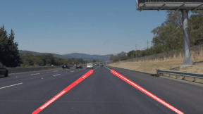
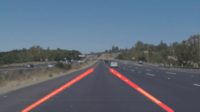

# FIND LANE LINES
This project is about building a lane line detector, it is part of the Udacity self-driving car Nanodegree. 

The project contains the following files:

- Readme.md (This file): Writeup of the project
- finding-lane-lines.ipynb: Notebook with the python code and comments
- finding-lane-lines.py: Same code without the annotations of the notebook.
- test_images: Folder with test images
- test_videos: Folder with test videos
- output: Folder with image, video and gif output.

# Introduction
The list of steps to complete the pipeline is the next:
- Image color selection and image transformation
- Execute  Gaussian Blur
- Get Canny Edges
- Get the region of interest
- Get the Hough Lines
- Calculate and draw lane lines
- Process Image
- Process Video

The first steps are just the helper functions, and only it’s going to be mentioned their parametrization, the last steps are going to be explained in detail.

I'm adding comments about the functions but also the alternatives that i tried during the project.


## Helper Functions
This section includes the parametrization of the helper functions
 
 - Gaussian Blur with kernel_size=9
```python
	blur_img = gaussian_blur(filter_img, kernel_size=9)
```

- Canny Edges, with low_threshold=50 and high_threshold=100
```python
	edges = canny(blur_img, low_threshold=50, high_threshold=100)
```

- Region of interest, build a trapezoid using some fractions  of the size of the video
```python
	vertices = np.array([[(60, imshape[0]), (imshape[1]*7/16, imshape[0]*5/8), (imshape[1]*9/16, int(imshape[0]*5/8)), (imshape[1]-60, imshape[0])]], dtype=np.int32)
```

- Hough lines,
```python
	line_img = hough_lines(masked_edges, rho=1, theta=np.pi/180, threshold=1, min_line_length=8, max_line_gap=1)
```
    
 ## Color Selection and image transformation
I found that this part was very important, i was testing with the __grayscale transformation__, but i was getting nowhere with the __challenge video__. 

The challenge video, has some different light conditions that the grayscale transformation cant really capture. 

After some __testing and searching__, i found other transformation that behaves much better.
 - Transform the image to __HSL color space__  using the function __cv2.cvtColor__ (after doing this transformation the  lane lines can be seeing more clearly)
 - Create a mask to select the yellow and white colors using the function __cv2.inRange__, filtering just the wanted colors and reducing the objects to be evaluated in the region of interest.

After doing this, the challenge video works immediately. 


## Calculate and draw lane lines
I changed this code lots of times, trying different approaches. Probably the hardest thing to do was to separate the lines between left and right side, the interpolation of the points once there are already divided is straightforward.

### Right and Left Line separation
The separation of the lines is important because if not do it correctly, you cant find a good lane line that fits the ones in the road, or simply get glitch.

For this i tried three methods:
* First i tried to separate the lines based on their __slope__, if the slope was positive it was part of the left line, if not, was part of the right line. With a straight movement it works, but when the car is passing a curve it doesn't behave well. With straight movement the average slope is very close between all the hough lines, but in a curve you got lots of lines with different slopes (positive and negative)
* Second, i tried to execute a clustering algorithm using the __kmeans__ . The idea was to separate the points of one line to the other, setting the centroids of the cluster on the left and right side of the image. It kind of work, and probably i had to tune more this solution but sometimes the algorithm was not working as expected, and it ended creating sets mixing left and right lines.
* The third approach was to separate trapezoid of the region of interest by half, so the points would be easily separated according to their side. This simple solution works better that the other two (was the one i choose) but i cant stop thinking that this is not the best way to do it because i’m probably leaving out other cases (even if for the test images and videos works well).

### Slope and Intercept calculation
At first i tried to create an average of the intercepts and the slopes, later i improve it using a weighted average that works better, but finally what works best and more smoothly was to use a simple __linear regression__ to find left and right slope and intercept.

### Draw Lane Lines
Use the slope and intercept to draw the lines

## Process Image and Video
The main algorithm join all the previous steps to read, filter, calculate and draw the lane lines.

### Process Image
These are the steps for the image process function
* Filter colors white and yellow on a HSL color space transformed image.
* Smooth edges with gaussian blur
* Canny edge detection
* Create a region of interest using polygon
* Get lane lines
** Hough Line Detection
** Separate points between left and right lane
** Use regression models to calculate slope and intersect of left and right lanes
* Draw lane line with transparency
    
### Process Video
Function to process the videos using the process_image

## Images

|                                                          |                                                   |
|-----------------------------------------------------------|----------------------------------------------------|
|||
|output/solidWhiteCurve.jpg|output/solidWhiteRight.jpg|
|||
|output/solidYellowCurve.jpg|output/solidYellowCurve2.jpg|
|||
|output/solidYellowLeft.jpg|output/whiteCarLaneSwitch.jpg|


## Videos

| |
|-|
||
|output/solidWhiteRight.gif|
||
|output/solidYellowLeft.gif|


## Challenge Video

||
|-|
||
|output/challenge.gif|

# Conclusions

I think the results are satisfactory, i was able to process all the videos and images and the lane lines were correctly identified. I learned some on the cv2 lib and now understand some of the difficulties on image processing.

There are still some glitches in the videos (sometimes the line gets lost on the image) and i would like to see more “smoothly” movement of the lane line (it makes like little jumps)

The challenge video was harder to process because, one, the car was going on a curve (all the other images an videos were on straight lanes) and second the light conditions were different. This project is only the first step to build a more robust lane line detector, because is easy to see that the color and light conditions could be in a very wide range of values, we surely will have to improve this project. 


There are two things that were difficult for me, 
- One was separating the lines between left and right side, the positive and negative slope wasn’t enough to separate the lines. I separate the image in two halves and it seems to work, but because of the possible geometries of the roads it has to exists other mechanisms to process the image and capture the sides more accurately. 

- I was getting very bad results in the challenge video and i had to look for a solution. The image HSL transformation and white and yellow color mask helps a lot to the program to identify more easily all the lines.

## References

I got some ideas from https://github.com/naokishibuya/car-finding-lane-lines specially the code for the HSL transformation and color separation


