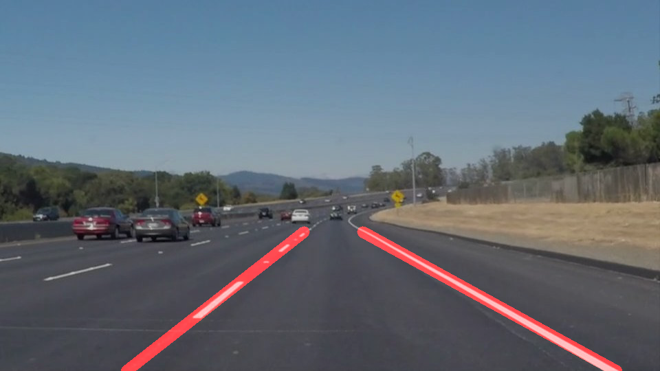

# FIND LANE LINES

Next, is all the algorithm that i wrote to find lane lines from the image and test videos. I'm adding comments about the functions but also the alternatives that i tried during the project.

## Helper Functions
This section includes the imports and some helper functions copied from the project template.
    1. Canny Edges
    2. Gaussian Blur
    3. Region of interest
    4. Hough lines
    
    
 ## Color Selection and image transformation
I found that this part was very important, i was testing with the __grayscale transformation__, but i was getting nowhere with the challenge video. 

The challenge video, has some different light conditions that the grayscale transformation cant really capture. 

After some __testing and searching__, i found other transformation that behaves much better.
    1. Transform the image to HSL color space  using the function cv2.cvtColor (after doing this transformation the  lane lines can be seeing more clearly)
    2. Create a mask to select the yellow and white colors using the function cv2.inRange, filtering just the wanted colors and reducing the objects to be evaluated in the region of interest.

After doing this, the challenge video works immediately. 

## Calculate and draw lane lines
I changed this code lots of times, trying different approaches. Probably the hardest thing to do was to separate the lines into left and right lane lines, the interpolation of the points once there are already divided is straightforward.

### Right and Left Line separation
The separation of the lines is important because if not do it correctly, you cant find a good lane line that fits the ones in the road, or simply get glitch.

For this i tried three methods:
* First i tried to separate the lines based on their __slope__, if the slope was positive it was part of the left line, if not, was part of the right line. With a straight movement it works, but when the car is passing a curve it doesn't behave well. With straight movement the average slope is very close between all the hough lines, but in a curve you got lots of lines with different slopes (positive and negative)
* Second, i tried to execute a clustering algorithm using the __kmeans__ . The idea was to separate the points of one line to the other, setting the centroids of the cluster on the left and right side of the image. It kind of work, and probably i had to tune more this solution but sometimes the algorithm was not working as expected, and it ended creating sets mixing left and right lines.
* The third approach was to separate trapezoid of the region of interest by half, so the points would be easily separated according to their side. This simple solution works better that the other two (was the one i choose) but i cant stop thinking that this is not the best way to do it because i’m probably leaving out other cases (even if for the test images and videos works well).

### Slope and Intercept calculation
At first i tried to create an average of the intercepts and the slopes, later i improve it using a weighted average that works better, but finally what works best and more smoothly was to use a simple __linear regression__ to find left and right slope and intercept.

### Draw Lane Lines
Use the slope and intercept to draw the lines

## Process Image and Video
The main algorithm join all the previous steps to read, filter, calculate and draw the lane lines.

### Process Image
These are the steps for the image process function
	1. Filter colors white and yellow on a HSL color space transformed image.
	2. Smooth edges with gaussian blur
	3. Canny edge detection
	4. Create a region of interest using polygon
	5. Get lane lines
		5.1 Hough Line Detection
		5.2 Separate points between left and right lane
		5.3 Use regression models to calculate slope and intersect of left and right lanes
	6. Draw lane line with transparency
    
### Process Video
Function to process the videos using the process_image

## Images

|                                                          |                                                   |
|-----------------------------------------------------------|----------------------------------------------------|
|||
|output/solidWhiteCurve.jpg|output/solidWhiteRight.jpg|
|||
|output/solidYellowCurve.jpg|output/solidYellowCurve2.jpg|
|||
|output/solidYellowLeft.jpg|output/whiteCarLaneSwitch.jpg|

## Videos

| |
|-|
|<video controls src="output/solidWhiteRight.mp4",width=400,height=200/>|
|output/solidWhiteRight.mp4|
|<video controls src="output/solidYellowLeft.mp4",width=400,height=200 />|
|output/solidYellowLeft.mp4|

## Challenge Video

||
|-|
|<video controls src="output/challenge.mp4",width=400,height=200/>|
|output/challenge.mp4|

